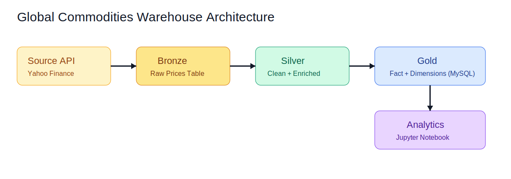

# Data Architecture

## Architecture Pattern

The project uses a Medallion data architecture:

- Bronze (raw ingestion)
- Silver (cleaned and standardized)
- Gold (dimensional model)

## End-to-End Flow

1. `etl/extract.py`

   - Pulls latest commodity prices from Yahoo Finance
   - Saves raw Bronze snapshot to `data/bronze/bronze_prices_*.csv`
   - Saves latest tabular extract output to `result/result.csv`
2. `etl/transform.py`

   - Cleans Bronze records
   - Normalizes timestamp to UTC-naive
   - Adds `year`, `month`, `day`, `price_change_pct`
   - Saves Silver snapshot to `data/silver/silver_prices_*.csv`
3. `etl/load.py`

   - Loads Bronze and Silver into MySQL
   - Deduplicates and removes out-of-scope commodities
   - Rebuilds Gold dimensions/fact from Silver
   - Exports `data/gold/gold_fact_snapshot.csv`
4. `etl/validate_warehouse.py`

   - Executes warehouse health checks

## Layer Responsibilities

### Bronze Layer

- Table: `bronze_commodity_prices`
- Purpose: preserve ingested records with minimal shaping
- Key fields: `commodity_name`, `price_usd`, `timestamp`, `source`

### Silver Layer

- Table: `silver_commodity_prices`
- Purpose: data quality filtering and enrichment
- Enrichment fields: `year`, `month`, `day`, `price_change_pct`

### Gold Layer

- Tables: `dim_commodity`, `dim_time`, `fact_commodity_price`
- Purpose: analytics-ready star schema for BI and SQL reporting

## Commodity Scope Note

The curated scope is defined in `etl/commodities_list.py` and currently includes 12 commodities.
