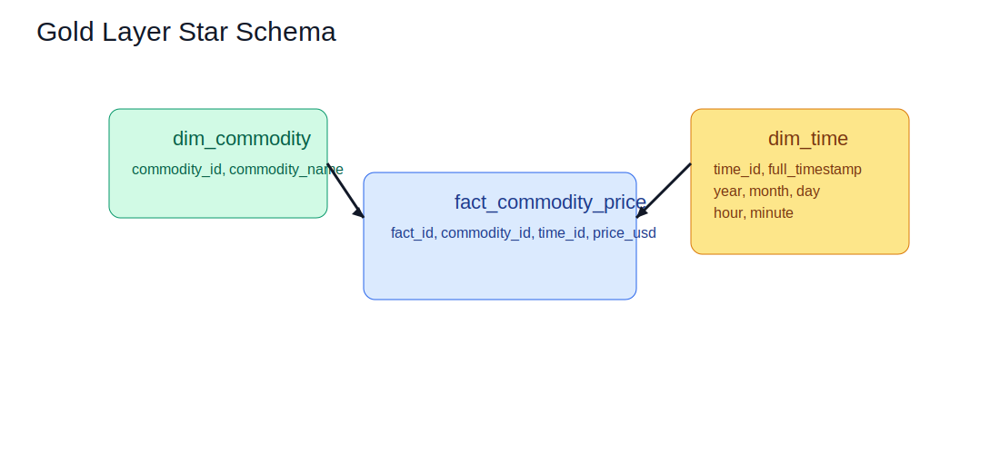

# Data Catalog

This catalog reflects the actual schema in `database/schema_mysql.sql`.

## Bronze Layer

### `bronze_commodity_prices`

| Column             | Type          | Description                                |
| ------------------ | ------------- | ------------------------------------------ |
| `bronze_id`      | BIGINT        | Surrogate primary key                      |
| `commodity_name` | VARCHAR(50)   | Commodity display name                     |
| `price_usd`      | DECIMAL(18,6) | Ingested price in USD                      |
| `timestamp`      | DATETIME      | Market timestamp (UTC-normalized)          |
| `source`         | VARCHAR(50)   | Data source label                          |
| `ingested_at`    | TIMESTAMP     | Load timestamp (default current timestamp) |

## Silver Layer

### `silver_commodity_prices`

| Column               | Type          | Description                         |
| -------------------- | ------------- | ----------------------------------- |
| `silver_id`        | BIGINT        | Surrogate primary key               |
| `commodity_name`   | VARCHAR(50)   | Standardized commodity name         |
| `price_usd`        | DECIMAL(18,6) | Cleaned price in USD                |
| `timestamp`        | DATETIME      | Normalized timestamp                |
| `source`           | VARCHAR(50)   | Data source label                   |
| `year`             | INT           | Derived year                        |
| `month`            | INT           | Derived month                       |
| `day`              | INT           | Derived day                         |
| `price_change_pct` | DECIMAL(10,4) | Percent price movement by commodity |
| `transformed_at`   | TIMESTAMP     | Transformation timestamp            |

## Gold Layer (Star Schema)

### `dim_commodity`

| Column             | Type        | Description           |
| ------------------ | ----------- | --------------------- |
| `commodity_id`   | INT         | Surrogate primary key |
| `commodity_name` | VARCHAR(50) | Unique commodity name |

### `dim_time`

| Column             | Type     | Description           |
| ------------------ | -------- | --------------------- |
| `time_id`        | INT      | Surrogate primary key |
| `full_timestamp` | DATETIME | Full market timestamp |
| `year`           | INT      | Calendar year         |
| `month`          | INT      | Calendar month        |
| `day`            | INT      | Calendar day          |
| `hour`           | INT      | Hour                  |
| `minute`         | INT      | Minute                |

### `fact_commodity_price`

| Column           | Type          | Description                          |
| ---------------- | ------------- | ------------------------------------ |
| `fact_id`      | BIGINT        | Surrogate primary key                |
| `commodity_id` | INT           | FK to `dim_commodity.commodity_id` |
| `time_id`      | INT           | FK to `dim_time.time_id`           |
| `price_usd`    | DECIMAL(18,6) | Measured price metric                |

## Constraints and Rules

- `dim_commodity.commodity_name` is unique
- `dim_time.full_timestamp` is unique
- `fact_commodity_price` has unique `(commodity_id, time_id)`
- Gold foreign keys enforce referential integrity
