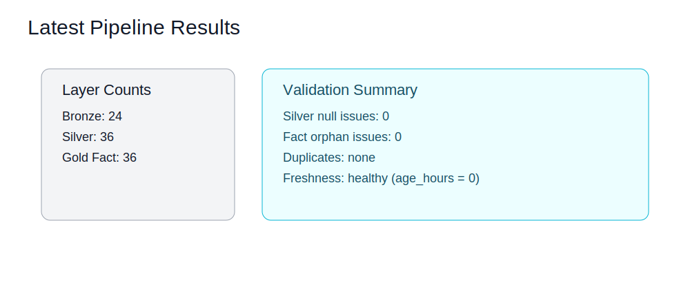

# Run Results and Validation

This file is the operational record template for ETL and warehouse validation.



## Execution Order

```bash
set -a && source .env && set +a
python3 etl/extract.py
python3 etl/transform.py
python3 etl/load.py
python3 etl/validate_warehouse.py
```

After `etl/extract.py`, verify latest output file:

```bash
head -n 20 result/result.csv
```

## SQL Verification

```bash
mysql -u root -p -D commodities_db < scripts/bronze/bronze_quality_checks.sql
mysql -u root -p -D commodities_db < scripts/silver/silver_quality_checks.sql
mysql -u root -p -D commodities_db < scripts/gold/gold_analytics.sql
```

## Validation Checklist

- Bronze table receives new rows
- Silver has no null issues in required fields
- Silver duplicate check returns no duplicate groups
- Gold fact has no orphan commodity/time keys
- Freshness check indicates current timestamps

## Latest Run (Update This Section Per Execution)

- Run date/time (UTC):
- Bronze row count:
- Silver row count:
- Gold fact row count:
- `dim_commodity` row count:
- `dim_time` row count:
- Null issues:
- Orphan issues:
- Duplicate groups:
- Freshness status:

## Notes

- Commodity scope is controlled by `etl/commodities_list.py`
- Latest extract run always overwrites `result/result.csv` with fresh values
- Use this file as the single place to record run evidence before portfolio submission
